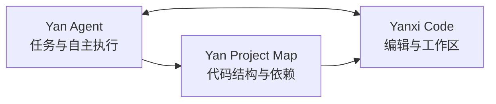

<p align="center">
  
</p>

<h1 align="center">Yan Agent</h1>

<p align="center">
  面向真实工作区的桌面端自主 Agent
</p>

<p align="center">
  
  
  
  
</p>

<p align="center"><a href="README_EN.md">English README</a></p>

Yan Agent 把对话、代码理解和本地工具执行放进同一个桌面工作台。选择一个工作区，描述目标，Agent 会制定计划、读写文件、运行命令、操作浏览器并验证结果，而不只是给出一段建议。

## v1.3.2

这次更新把重点放在 Agent 的真实工作可靠性上：它不仅要会调用工具，还要知道什么时候该调用、失败后如何停下来、以及用户能否清楚看见发生了什么。安装包版本同步升级到 v1.3.2。

- **任务内核更可靠。** 模型断流、空响应、MCP 启动失败和工具异常都会留下明确的对话错误，不再出现任务已经停止但界面仍显示“正在工作”的情况。长任务增加上下文压缩、迭代上限和重复错误熔断，连续陷入同一错误时会主动停下并说明原因。
- **动态能力调用。** Agent 会先根据用户目标判断是否需要 Git、MCP、Skill、浏览器或电脑操作能力，再按需加载具体工具。做一个网页或小游戏时，默认走内置浏览器验收，不会为了“看起来完整”额外生成 Playwright 脚本或调用无关工具。
- **Skill 更像工作台的一部分。** 输入框新增已安装 Skill 选择器，支持一次任务组合多个 Skill，并把调用状态放在输入区域内展示。市场内容与本机已安装内容分开，用户引用时只会看到真正可用的技能。
- **工作区真正隔离。** 每个任务保存自己的工作区、终端目录、工具快照和运行状态。新建空任务会回到用户默认目录，Agent 创建并进入子文件夹后会同步切换当前工作区，减少反复 `cd` 和误写其他任务目录的风险。
- **权限访问更清楚。** 输入框提供“请求批准”“替我审批”“完全访问”三档策略。完全访问支持必要的绝对路径操作，但开启前会二次确认，文件、网络和高风险系统命令的安全边界仍然保留。
- **Computer Use 与界面反馈。** 电脑操作插件补齐了调用提示、蓝色氛围边框和导航光标，工具执行、对话输出、桌宠状态和中止按钮会同步更新，便于用户判断 Agent 正在做什么。

## v1.3.0

这一版本完成了 Yan 桌面开发生态的闭环：

| 能力                  | 说明                                        |
| ------------------- | ----------------------------------------- |
| **Yan Agent**       | 5 个隔离任务并行执行，支持文件、Shell、Git、浏览器、图片和 MCP 工具 |
| **Yan Project Map** | 在应用内生成可交互项目地图，展示目录、符号和依赖关系，并支持 AI 解读      |
| **Yanxi Code**      | 从任务栏一键打开当前工作区；冷启动和已运行状态都能双向同步工作区          |
| **多端协同**            | 桌面主界面、移动端控制页和桌面宠物共享任务与运行状态                |

### 本次更新

- 新增 Yan Project Map：增量代码索引、依赖连线、缩放浏览、模型切换和 AI 项目解读
- 完成 Yanxi Code 生态对接：自动检测安装位置，原子交接工作区，支持冷启动与运行中切换
- 新增内置终端和内置浏览器，让 Agent 的执行与验证留在同一工作台
- 新增常驻桌面宠物：跟随当前任务、显示运行状态和资源占用，并可直接停止任务
- 完善移动端控制：任务搜索、切换、重命名、删除、模型同步、图片上传与结果预览
- 完善多模态链路：图片输入、图片生成、编辑、持久化预览和下载
- 新增 Kimi K3、Kimi K2.7 Code 等模型，并更新主流厂商模型与价格展示
- 展示每次 Agent 运行产生的文件变更摘要，任务切换和后台执行保持工作区隔离

## 核心能力

### 自主执行

```text
用户目标 -> 制定计划 -> 调用工具 -> 检查结果 -> 继续修正 -> 交付
```

- 最多 5 个任务并行运行，每个任务都有独立工作区、上下文和中止控制。你可以在任务之间切换，而不必等待前一个任务结束，后台任务也会继续执行。
- 文件读取、精确编辑、补丁应用、目录扫描和写后校验组成一条完整修改链路。每次写入都会回读确认，减少“看起来改了、实际没生效”的情况。
- Shell 命令、Git 操作、内置终端和内置浏览器都在当前工作台内完成。Agent 可以先读代码，再运行验证命令，最后把文件变更和结果一起交付。
- Todo 与完成门控会把计划和验收条件放在同一条任务线上。只要还有未完成步骤或缺少验证证据，Agent 就不会把任务提前标记为完成。
- 失败按可重试错误、权限错误和副作用错误分类处理。读操作可以自动重试，写入、提交等副作用操作不会被盲目重复执行。

### 代码理解

- 文件大纲、符号搜索、引用追踪和 import 分析让 Agent 能先建立代码事实，再开始修改。对于大型文件，也可以只读取相关范围，避免无意义地塞满上下文。
- 项目扫描、相关文件发现和持久化代码索引会复用未变化的分析结果。索引保存在 `.yanagent/code-index.json`，下次打开同一工作区可以更快恢复结构。
- Yan Project Map 把目录、文件、符号和依赖边变成可交互地图。你可以从一个入口文件追到相关模块，再把选中的节点带回 Agent 对话。
- AI 解读复用当前模型配置，同时保留本地分析能力。即使没有可用模型，目录、符号和依赖结构仍然可以正常展示。

### 多模态

- 附件入口会根据当前模型能力动态开放图片输入。切换到文本模型时不会伪装成支持视觉，切换到多模态模型后才显示对应操作。
- 视觉模型可以分析截图、设计稿和代码界面，适合把“看起来哪里不对”变成可执行的修改任务。图片会以结构化消息传递给模型，不会偷偷转成无意义的文本描述。
- 支持 OpenAI 与 Grok 图片生成链路，也支持带参考图的编辑流程。生成结果会被保留为本地会话资源，方便之后继续使用。
- 生成图片可以在桌面端和移动端预览、打开与下载。任务历史保留资源引用，不会因为刷新界面就丢失结果。

### 扩展系统

- 17 个内置 Skill 和 52 个 Skill 市场模板覆盖代码审查、重构、UI、文档和网页工作流。Skill 通过提示词和工具权限组合复用，不需要修改 Agent 内核。
- 支持本地安装、自定义 Skill 的读取与审计，团队可以把自己的项目约定固化成可重复调用的工作流。目录不再后台联网同步，已安装内容与内置市场清晰分开。
- 通过 JSON-RPC 2.0 over stdio 接入 MCP Server。每个运行任务会保留自己的工具映射快照，多个任务并行时不会互相覆盖配置。
- 预置 Playwright 与 Windows-MCP，并支持自定义服务及环境变量。需要 GitHub Token、数据库连接或其他凭据时，可以按服务单独配置。

## Yan 生态



在 Yan Agent 中为任务选择工作区后，可以直接打开 Yan Project Map，也可以一键进入 Yanxi Code。工作区通过带回执的本地交接协议同步，即使 Yanxi Code 已经运行，也会刷新标题栏和文件树。

## 支持的模型

| 厂商       | 当前接入方式                                         |
| -------- | ---------------------------------------------- |
| OpenAI   | 动态读取可用模型，支持视觉与图片生成能力识别                         |
| Grok     | 动态读取可用模型，支持 Imagine 图片生成                       |
| Agnes    | 动态读取 Agnes AI 网关模型目录                         |
| 自定义模型   | 用户填写 Base URL、API Key 与模型 ID，直接使用 OpenAI Chat Completions |
| DeepSeek | DeepSeek V4 Flash / V4 Pro                     |
| 通义千问     | Qwen3.7、Qwen3.6、Qwen3、Qwen Plus / Turbo / Long |
| 智谱 GLM   | GLM-5.2、GLM-5 系列、GLM-4.7 与 Flash 系列            |
| 豆包       | Doubao Seed 2.1 / 2.0 系列                       |
| Kimi     | Kimi K3、K2.7 Code、K2.6、K2.5                    |
| StepFun  | Step 3.7 Flash / 3.5 Flash                     |
| MiniMax  | MiniMax M3 / M2.7                              |
| 百川智能     | Baichuan 4 / Baichuan 3 Turbo                    |
| 零一万物     | Yi Large / Yi Lightning                          |
| 腾讯混元     | 混元 Turbo S / 混元 Pro                            |
| 硅基流动     | 动态读取 SiliconFlow 可用模型目录                       |

每个厂商拥有独立 API Key、可编辑 Base URL、模型列表和能力判断，可直接连接官方 API、CC Switch、中转站或自建 OpenAI 兼容网关。选择“自定义模型”时，只需填写服务商 Base URL、API Key 和模型 ID，Yan Agent 会直接按 OpenAI Chat Completions 协议请求，不启动本地连接、不做模型映射。图片模型还可单独配置文生图与 P 图 POST URL。模型与价格可能随服务商调整，应用内展示用于选型参考，实际费用以服务商账单为准。

## 快速开始

1. 下载并安装 Yan Agent。
2. 打开 `设置 -> API 配置`，选择厂商并填写 Base URL 与 API Key。
3. 新建任务并选择一个工作区。
4. 输入目标，等待 Agent 执行并检查最终文件变更。

### 下载

| 构建  | 说明              | 下载                                                                                                                        |
| --- | --------------- | ------------------------------------------------------------------------------------------------------------------------- |
| 安装版 | NSIS 安装包，适合日常使用 | [Yan.Agent.Setup.1.3.2.exe](https://github.com/666-gy/Yan-Agent/releases/download/v1.3.2/Yan.Agent.Setup.1.3.2.exe)       |
| 便携版 | 无需安装，解压后直接运行    | [前往 v1.3.2 Release 查看](https://github.com/666-gy/Yan-Agent/releases/tag/v1.3.2) |

[查看全部 Releases](https://github.com/666-gy/Yan-Agent/releases)

## 权限与数据

Yan Agent 会在你选择的工作区内执行真实操作。文件读取、写入、网络访问与命令执行可在设置页分别控制，其中命令执行默认需要显式开启。

应用数据保存在用户数据目录中，包含配置、会话、任务日志、生成图片和本地记忆。工作区中的代码索引保存在 `.yanagent/code-index.json`。

建议：

- 在使用 Git 的项目中运行，重要操作前保留可恢复版本
- 只为可信 MCP Server 配置凭据和环境变量
- 运行高影响命令前检查 Agent 给出的计划与权限提示

## 开发

### 环境

- Windows 10 / 11
- Node.js 18+
- npm 9+

```bash
git clone https://github.com/666-gy/Yan-Agent.git
cd Yan-Agent
npm install
npm start
```

### 常用命令

```bash
npm start                # 本地启动
npm run build            # Windows 安装版
npm run build:portable  # Windows 便携版
```

### 项目结构

```text
Yan-Agent/
|-- main.js                  Electron 主进程、IPC 与本地服务
|-- preload.js               沙箱化渲染进程桥接
|-- lib/
|   |-- code-index.js        代码索引
|   |-- code-map.js          项目地图分析
|   |-- terminal-manager.js  内置终端
|   `-- skills/              Skill 目录
|-- renderer/
|   |-- index.html           桌面应用界面
|   |-- renderer.js          会话、任务与 UI 协调
|   |-- kernel/              Agent 循环、工具与运行策略
|   |-- code-map/            Yan Project Map
|   |-- terminal/            终端界面
|   |-- remote/              移动端界面
|   |-- pet/                 桌面宠物
|   `-- assets/              品牌资源
`-- package.json
```

## 技术栈

Electron 31 · Node.js · Vanilla JavaScript · OpenAI-compatible APIs · MCP · electron-builder

## License

MIT
