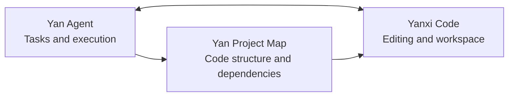

<p align="center">
  
</p>

<h1 align="center">Yan Agent</h1>

<p align="center">
  An autonomous desktop agent for real workspaces
</p>

<p align="center">
  
  
  
  
</p>

<p align="center"><a href="README.md">中文 README</a></p>

Yan Agent brings conversation, code understanding, and local tool execution into one Windows workspace. Describe an outcome, choose a project folder, and the agent plans, edits, runs, browses, verifies, and reports the result instead of stopping at a suggestion.

## v1.3.0

Version 1.3.0 completes the first Yan desktop ecosystem loop:

| Product | What it does |
| --- | --- |
| **Yan Agent** | Runs up to five isolated tasks with filesystem, shell, Git, browser, image, and MCP tools |
| **Yan Project Map** | Turns directories, symbols, and dependencies into an interactive project map with AI explanations |
| **Yanxi Code** | Opens the selected workspace from the task bar and synchronizes it in both cold-start and already-running states |
| **Shared surfaces** | Keeps the desktop app, mobile control page, and desktop pet aligned around the same tasks and runtime state |

### Highlights

- **Project mapping.** Incremental code indexing, dependency edges, zoomable exploration, model selection, and AI explanations make an unfamiliar repository easier to navigate. Local analysis still works when no analysis model is available.
- **Yanxi Code integration.** Yan Agent detects the installed IDE, writes an atomic workspace handoff, and waits for a receipt. A running Yanxi Code window refreshes its title and file tree instead of falling back to the welcome screen.
- **A complete workbench.** The built-in terminal and browser keep execution and verification beside the conversation. The agent can inspect a file, run a command, open a local page, and return with evidence without switching applications.
- **Desktop pet supervision.** The pet follows the selected task, reports runtime status and resource usage, and exposes a direct stop action. It is a small always-available view of what the agent is doing in the background.
- **Mobile control.** Search, switch, rename, and delete tasks from the mobile page while desktop and mobile stay synchronized. Image upload, model changes, and generated-image previews follow the same session rules.
- **Multimodal work.** Image input is exposed only for models that support it, while image generation and editing keep their outputs as persistent local assets. The same generated result can be previewed, opened, or downloaded from desktop and mobile.
- **Current models.** The catalog includes Kimi K3, Kimi K2.7 Code, DeepSeek V4, Qwen3.7, GLM-5.2, Doubao Seed, Step 3.7, MiniMax M3, and dynamic OpenAI/Grok catalogs. Prices and availability are shown for orientation and remain subject to each provider's billing page.
- **Reliable delivery.** Five tasks run with isolated state, workspace, abort control, and MCP snapshots. File edits are checked after writing, todo completion requires evidence, and side-effect tools are not blindly retried.

## Core capabilities

### Autonomous execution

```text
Goal -> Plan -> Tools -> Verification -> Refinement -> Delivery
```

- Run up to five tasks at once, each with its own workspace, context, and cancellation control. Switching conversations only changes the visible surface; background work continues independently.
- Read files, apply exact edits, write patches, scan directories, and verify the result after every write. This makes the agent's changes inspectable rather than magical.
- Use shell commands, Git operations, the built-in terminal, and the built-in browser in one workflow. The agent can gather evidence before it claims that a task is complete.
- Todos and completion gates keep unfinished work visible. A run cannot quietly finish while required steps or acceptance evidence are still missing.
- Transient read failures can be retried automatically, while permissions and side-effect failures are surfaced instead of being repeated blindly.

### Code understanding

- File outlines, symbol search, reference tracing, import analysis, project scanning, and related-file discovery help the agent build a grounded view of a codebase first.
- The persistent index at `.yanagent/code-index.json` reuses unchanged analysis. Large files can be inspected by range, keeping context focused on the code that matters.
- Yan Project Map presents directories, files, symbols, and dependency edges as an explorable surface. Select a node to understand its role, then bring that context back into an Agent task.
- Natural-language explanations are an enhancement layer over local facts. The map still provides useful structure when the configured model is unavailable.

### Multimodal work

- The attachment menu follows the active model's capabilities. Text-only models do not receive image bytes, and vision actions appear only when they are supported.
- Vision models can inspect screenshots, UI states, diagrams, and code interfaces. This turns a visual problem into a concrete workspace task instead of a vague description.
- OpenAI and Grok image-generation flows support generation and reference-image editing. Results are retained as local conversation assets so they remain available after a refresh.
- Generated images can be previewed, opened, and downloaded from both desktop and mobile surfaces. The task history keeps the asset reference alongside the agent output.

### Skills and MCP

- Seventeen built-in Skills and fifty-one marketplace templates cover code review, refactoring, UI work, documentation, and web workflows. Skills combine reusable instructions with explicit tool access without changing the kernel.
- Custom Skills can be read, synchronized, and audited separately from the built-in catalog. Project-specific conventions can therefore become repeatable actions rather than tribal knowledge.
- MCP servers connect through JSON-RPC 2.0 over stdio. Each running task receives an isolated tool snapshot so parallel tasks cannot overwrite one another's server mapping.
- Playwright and Windows-MCP templates are included, with support for custom servers and per-server environment variables for credentials or project services.

## Yan ecosystem



Choose a workspace once in Yan Agent, then open the project map or Yanxi Code from the task bar. The handoff protocol includes a request ID and a receipt, so an already-running Yanxi Code instance can switch workspaces without returning to its welcome page.

## Supported model providers

| Provider | Examples |
| --- | --- |
| OpenAI | Dynamic model catalog with vision and image-generation capability detection |
| Grok | Dynamic model catalog with Imagine image generation |
| DeepSeek | DeepSeek V4 Flash / V4 Pro |
| Qwen | Qwen3.7, Qwen3.6, Qwen3, Qwen Plus / Turbo / Long |
| Zhipu GLM | GLM-5.2, GLM-5 series, GLM-4.7 and Flash series |
| Doubao | Doubao Seed 2.1 / 2.0 series |
| Kimi | Kimi K3, Kimi K2.7 Code, Kimi K2.6, Kimi K2.5 |
| StepFun | Step 3.7 Flash / 3.5 Flash |
| MiniMax | MiniMax M3 / M2.7 |

Each provider has its own API key, base URL, model list, and capability metadata. Provider prices and availability can change; the application display is a selection aid, while billing is determined by the provider.

## Quick start

1. Download and install Yan Agent.
2. Open `Settings -> API Configuration`, choose a provider, and enter its API key.
3. Create a task and choose a workspace folder.
4. Describe the outcome and inspect the final file-change summary when the agent finishes.

### Downloads

| Build | Description | Download |
| --- | --- | --- |
| Installer | NSIS installer with shortcuts for daily use | [Yan.Agent.Setup.1.3.0.exe](https://github.com/666-gy/Yan-Agent/releases/download/v1.3.0/Yan.Agent.Setup.1.3.0.exe) |
| Portable | No installation required; run it directly | [Yan.Agent.Portable.1.3.0.exe](https://github.com/666-gy/Yan-Agent/releases/download/v1.3.0/Yan.Agent.Portable.1.3.0.exe) |

[View all releases](https://github.com/666-gy/Yan-Agent/releases)

## Permissions and data

Yan Agent performs real operations in the workspace you select. File reads, writes, network access, and command execution can be controlled from Settings, and command execution is intended to remain an explicit permission.

Application data includes configuration, sessions, task logs, generated images, and local memory. Workspace code indexes are stored in `.yanagent/code-index.json`.

Use Yan Agent in a trusted workspace, keep recoverable Git history for important projects, and configure credentials only for MCP servers you trust.

## Development

### Requirements

- Windows 10 or 11
- Node.js 18+
- npm 9+

```bash
git clone https://github.com/666-gy/Yan-Agent.git
cd Yan-Agent
npm install
npm start
```

### Build commands

```bash
npm start                # Run locally
npm run build            # Build the Windows installer
npm run build:portable  # Build the Windows portable executable
```

### Project structure

```text
Yan-Agent/
|-- main.js                  Electron main process, IPC, and local services
|-- preload.js               Sandboxed renderer bridge
|-- lib/                     Code index, project map, terminal, skills, and runtime libraries
|-- renderer/                Desktop UI, kernel, project map, terminal, mobile, and pet surfaces
|-- build/                   Installer configuration used by electron-builder
|-- docs/                    Project homepage and architecture notes
|-- package.json             Runtime and build configuration
`-- README.md                Chinese documentation
```

## Technology

Electron 31 · Node.js · Vanilla JavaScript · OpenAI-compatible APIs · MCP · electron-builder

## License

MIT
